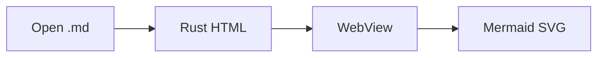
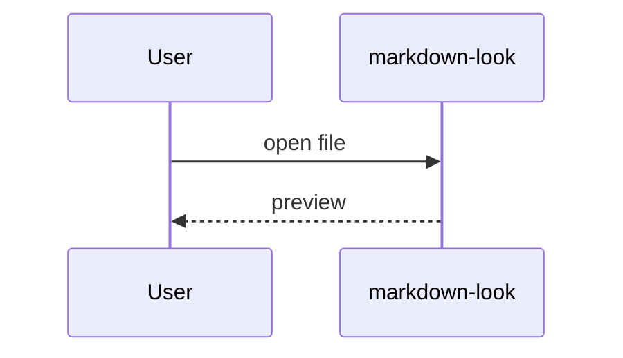

# Mermaid sample

Flowchart:

```mermaid
flowchart LR
  A[Open .md] --> B[Rust HTML]
  B --> C[WebView]
  C --> D[Mermaid SVG]
  click A "./sample.md" "Open sample.md"
  click D "https://mermaid.js.org/" "Mermaid docs"
```

Sequence:

```mermaid
sequenceDiagram
  participant U as User
  participant App as markdown-look
  U->>App: open file
  App-->>U: preview
```
